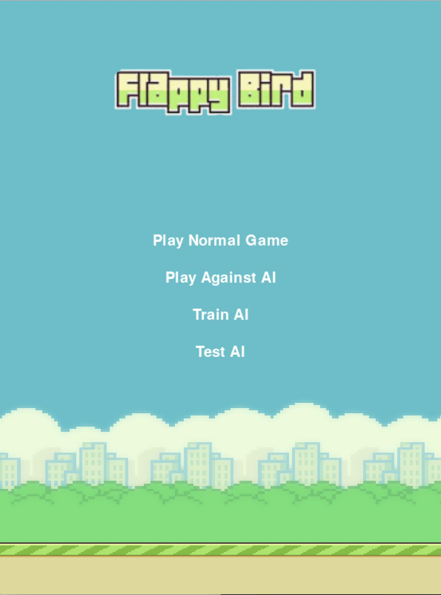

# flappy-bird-ai

The game of Flappy Bird played by an AI.
The AI is trained on a NN/genetic algorithm using the library **Neat**

## References

This game is inspired by the following tutorial:

- [YouTube Playlist](https://www.youtube.com/playlist?list=PLzMcBGfZo4-lwGZWXz5Qgta_YNX3_vLS2)
- [GitHub Repository](https://github.com/techwithtim/NEAT-Flappy-Bird)

## Installation

Install the dependencies:

```pip install -r requirements.txt```

Run the game:

```python run.py```

## What the game offers

There are four modes in this game:



In each of the views of these four modes, there is a button in the top right corner to get back to this start/landing view.

### 1. Play normal game

You play a game of Flappy Bird.
There is a count of your score.
When the game ends you can replay the game.


### 2. Play Against AI

You play a **Orange** Flappy Bird.
The AI/Computer in a **Blue** Flappy Bird.

**Try to beat the AI!**


### 3. Train AI

You can make your own AI by training it.
When opening this view, you will start running the genetic algorithm.

#### Algorithm quick explanation

It works as follows:

There are a fixed number of generations *(default value: 10)* that corresponds to a game of Flappy Bird

Each generation comprises a fixed number of birds: pop_size *(default value: 15)* that play the same game at the same time.

As a explanation, at the end of each generation, the algorithm will keep the birds that performed the best to create similar birds for the next generation.

For more detailed explanation, [click here](http://nn.cs.utexas.edu/downloads/papers/stanley.cec02.pdf)


#### Tweak the parameters

The two main parameters of the algorithm are:

1. The generations number
2. The number of birds by generation

To modify these parameters:

1. For **generation number**: you go in ```./config/neat/neat_config```, it is the ```GENERATIONS_NUMBER``` value
2. For **number of birds by generation**: you go in ```./config/neat/network_config.txt```, it is the ```pop_size``` value

#### About the view

In the view, i.e for each generation, will be displayed:

- The number of birds still alive
- The score
- The number of the generation we are running

**WARNING:** When you start this view, please be patient and keep it running until getting the result of the training. Then you can get back to the start view by clicking on the top right return button.

### 4. Test AI

At the end of **train mode**, after performing the genetic algorithm, we "save" the "Best bird".

In the test view you can see this "Best bird" play.


Note that this best bird will also be the AI bird you play against in the "Play Against AI" mode.
